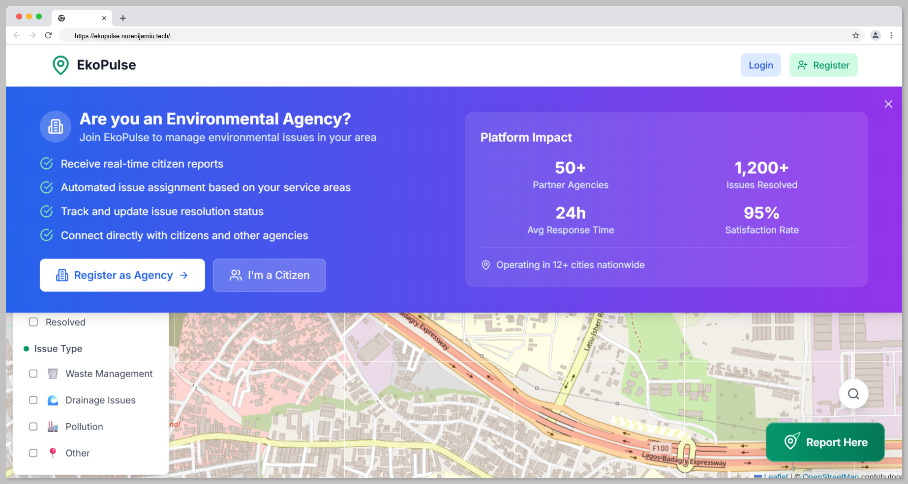

# EkoPulse - Environmental Issue Reporting Platform

<div align="center">

[](https://ekopulse.nurenijamiu.tech)
[](https://opensource.org/licenses/MIT)
[](https://www.typescriptlang.org/)
[](https://reactjs.org/)
[](https://nodejs.org/)

**EkoPulse is a comprehensive web application designed to help citizens of Lagos, Nigeria report environmental issues and enable authorities to track and respond to them efficiently. The platform features real-time updates, interactive mapping, and role-based access control.**

*Itesiwaju Eko lo je wa logun!*

</div>

## 🖼️ Project Preview



## 🌟 Features

### Core Functionality
- **User Authentication**: Secure authentication powered by Clerk with citizen and authority roles
- **Interactive Map**: Leaflet-based map of Lagos displaying environmental issue pins
- **Issue Reporting**: Citizens can report issues with location, description, type selection, and photo upload
- **Issue Visualization**: Color-coded pins on map with detailed modal views
- **Status Management**: Authorities can update issue status (Reported → Under Review → Resolved)
- **Authority Dashboard**: Comprehensive dashboard for authorities to manage all reports
- **Real-time Updates**: WebSocket integration for live issue updates and status changes

### Technical Features
- **Responsive Design**: Mobile-first design that works on all devices
- **Real-time Communication**: WebSocket-based live updates
- **Image Upload**: Cloudinary integration for image storage and optimization
- **Geographic Search**: Location-based issue filtering and search
- **Data Visualization**: Statistics and analytics for authorities

## 🛠 Technology Stack

### Frontend
- **React.js 18** with TypeScript
- **Vite** for build tooling
- **Tailwind CSS** for styling
- **Leaflet** with React-Leaflet for mapping
- **Clerk** for authentication
- **Socket.io-client** for real-time communication
- **React Hook Form** for form management
- **Axios** for API communication
- **React Hot Toast** for notifications

### Backend
- **Node.js** with TypeScript
- **Express.js** framework
- **MongoDB** with Mongoose ODM
- **Socket.io** for WebSocket communication
- **Clerk SDK** for authentication
- **Cloudinary** for image storage
- **Multer** for file uploads
- **Helmet** for security
- **Rate limiting** for API protection

## 📁 Project Structure

```
ekopulse/
├── frontend/
│   ├── src/
│   │   ├── components/
│   │   │   ├── common/          # Reusable components
│   │   │   ├── layout/          # Layout components
│   │   │   ├── map/             # Map-related components
│   │   │   ├── issues/          # Issue-related components
│   │   │   └── auth/            # Authentication components
│   │   ├── pages/               # Page components
│   │   ├── hooks/               # Custom React hooks
│   │   ├── contexts/            # React contexts
│   │   ├── utils/               # Utility functions
│   │   └── ...
│   └── ...
└── backend/
    ├── src/
    │   ├── config/              # Configuration files
    │   ├── controllers/         # Route controllers
    │   ├── middleware/          # Express middleware
    │   ├── models/              # Mongoose models
    │   ├── routes/              # API routes
    │   ├── websockets/          # WebSocket handlers
    │   └── server.ts            # Main server file
    └── ...
```

## 🚀 Quick Start

### Prerequisites
- Node.js (v18 or higher)
- MongoDB (local or Atlas)
- Clerk account
- Cloudinary account

### Environment Setup

#### Backend (.env)
```env
NODE_ENV=development
PORT=5000

# MongoDB
MONGODB_URI=mongodb://localhost:27017/ekopulse

# Clerk
CLERK_PUBLISHABLE_KEY=your_clerk_publishable_key
CLERK_SECRET_KEY=your_clerk_secret_key

# Cloudinary
CLOUDINARY_CLOUD_NAME=your_cloud_name
CLOUDINARY_API_KEY=your_api_key
CLOUDINARY_API_SECRET=your_api_secret

# CORS
FRONTEND_URL=http://localhost:5173
```

#### Frontend (.env)
```env
VITE_CLERK_PUBLISHABLE_KEY=your_clerk_publishable_key
VITE_API_BASE_URL=http://localhost:5000/api
VITE_WS_URL=http://localhost:5000
```

### Installation & Setup

1. **Clone the repository**
```bash
git clone <repository-url>
cd ekopulse
```

2. **Install Backend Dependencies**
```bash
cd backend
npm install
```

3. **Install Frontend Dependencies**
```bash
cd ../frontend
npm install
```

4. **Set up environment variables**
- Copy `.env.example` to `.env` in both frontend and backend directories
- Fill in your actual credentials

5. **Start MongoDB**
```bash
# If using local MongoDB
mongod
```

6. **Start the Backend Server**
```bash
cd backend
npm run dev
```

7. **Start the Frontend Development Server**
```bash
cd frontend
npm run dev
```

8. **Access the Application**
- Frontend: http://localhost:5173
- Backend API: http://localhost:5000

## 🗺 Map Configuration

The application is specifically configured for Lagos, Nigeria with the following bounds:
- **Center**: 6.5244°N, 3.3792°E
- **Bounds**:
  - North: 6.7028°N
  - South: 6.3458°N
  - East: 3.6969°E
  - West: 3.0615°E

## 👥 User Roles

### Citizens
- Report environmental issues
- View all issues on the map
- Track their own reports
- Receive status update notifications

### Authorities
- View all reported issues
- Update issue status
- Access comprehensive dashboard
- Manage issue assignments

## 🔧 API Endpoints

### Authentication
- `GET /api/auth/user` - Get current user
- `POST /api/auth/user` - Create/get user
- `PUT /api/auth/user/role` - Update user role

### Issue Type Colors
- **Waste**: Red (#dc2626)
- **Drainage**: Blue (#2563eb)
- **Pollution**: Purple (#7c3aed)
- **Other**: Gray (#6b7280)

## 🛡 Security Features

- **Authentication**: Clerk-based secure authentication
- **Rate Limiting**: API endpoint protection
- **Input Validation**: Server-side validation with Joi
- **CORS Protection**: Configured for specific origins
- **Helmet**: Security headers
- **File Upload Security**: Type and size validation

## 📈 Monitoring & Analytics

The application includes:
- Real-time issue statistics
- User activity tracking
- Error monitoring
- Performance metrics

## 🤝 Contributing

1. Fork the repository
2. Create a feature branch
3. Make your changes
4. Add tests if applicable
5. Submit a pull request

## 📄 License

MIT License - see LICENSE file for details

## 🆘 Support

For support and questions:
- Create an issue in the repository
- Check the documentation
- Review the API documentation

## 🔄 Version History

### v1.0.0 (MVP)
- Initial release with core features
- User authentication
- Issue reporting and management
- Real-time updates
- Authority dashboard

## 🔮 Future Enhancements

Potential future features:
- Mobile app versions
- Email notifications
- Advanced analytics
- Multi-language support
- Integration with government systems
- Public API for third-party developers

---

**EkoPulse** - Making Lagos cleaner, one report at a time. 🌍
